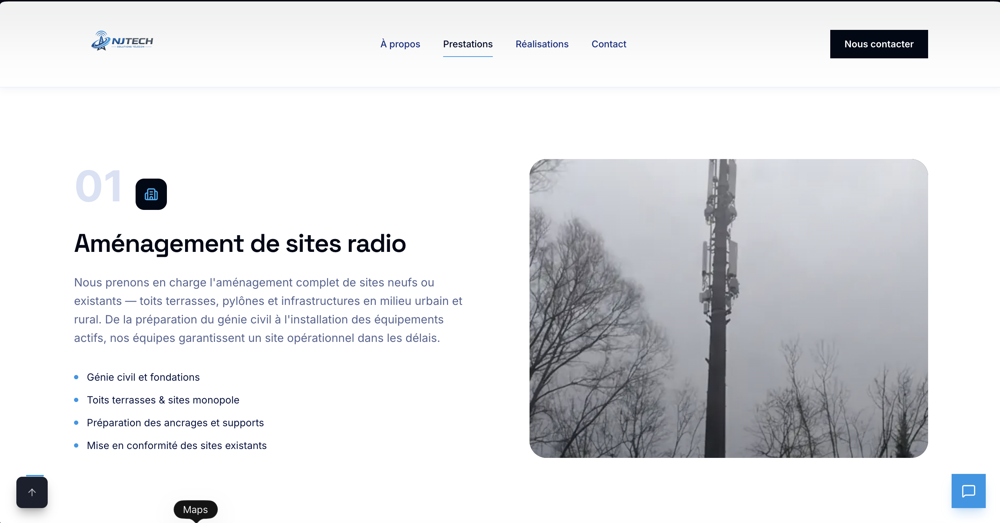
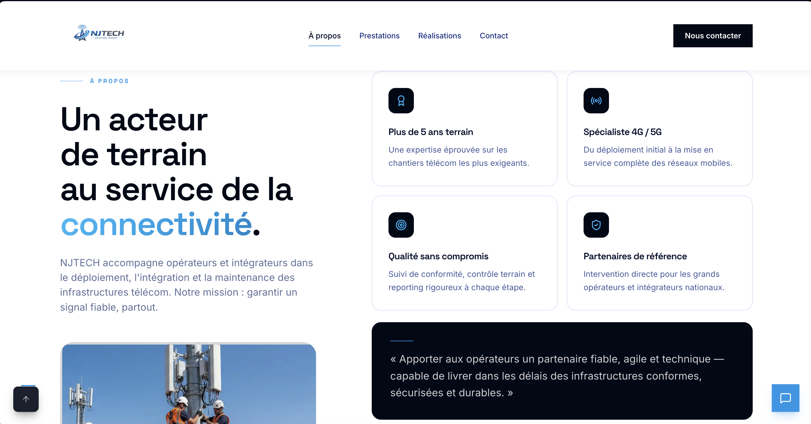
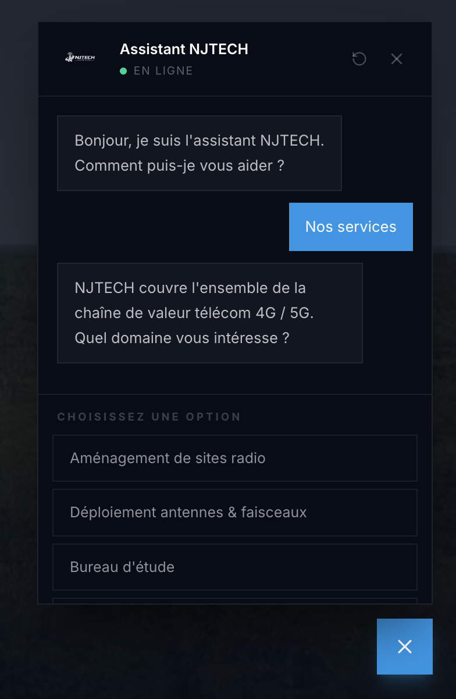
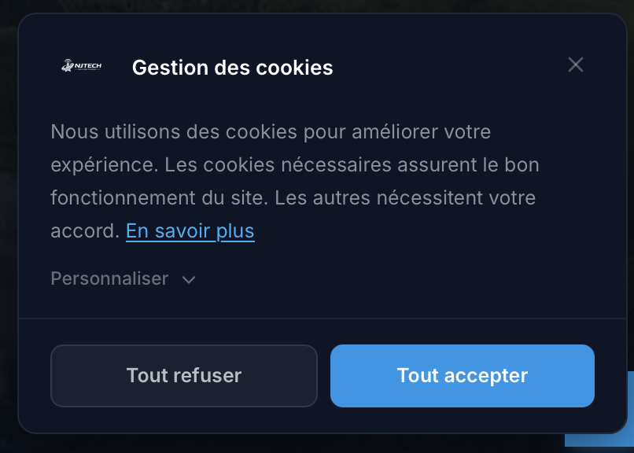

<div align="center">

# NJTECH Solution — Site vitrine

**Site web officiel de NJTECH Solution**, spécialiste du déploiement, de l'intégration et de la maintenance des infrastructures télécom mobiles 4G / 5G en France.

[](https://github.com/MOUADx4/njtech/actions/workflows/ci.yml)
[](./tests)

[](https://nextjs.org/)
[](https://react.dev/)
[](https://www.typescriptlang.org/)
[](https://tailwindcss.com/)
[](https://www.framer.com/motion/)
[](https://lenis.darkroom.engineering/)

</div>

---

## Aperçu


Site vitrine responsive et animé, pensé pour valoriser le savoir-faire terrain de NJTECH Solution auprès des opérateurs et intégrateurs télécom. L'accent est mis sur la lisibilité, la performance et une identité visuelle sobre (navy + bleu signal).

<table>
  <tr>
    <td width="50%"><p align="center"><sub>Prestations techniques</sub></p></td>
    <td width="50%"><p align="center"><sub>Réalisations</sub></p></td>
  </tr>
  <tr>
    <td width="50%"><p align="center"><sub>À propos</sub></p></td>
    <td width="50%"><p align="center"><sub>Contact</sub></p></td>
  </tr>
  <tr>
    <td width="50%"><p align="center"><sub>Assistant intégré</sub></p></td>
    <td width="50%"><p align="center"><sub>Bandeau de consentement (RGPD)</sub></p></td>
  </tr>
</table>

---

## Sommaire

- [Fonctionnalités](#fonctionnalités)
- [Stack technique](#stack-technique)
- [Prérequis](#prérequis)
- [Installation](#installation)
- [Variables d'environnement](#variables-denvironnement)
- [Scripts disponibles](#scripts-disponibles)
- [Arborescence](#arborescence)
- [Pages du site](#pages-du-site)
- [Déploiement](#déploiement)
- [Conformité & SEO](#conformité--seo)
- [Personnalisation](#personnalisation)
- [Système de design](#système-de-design)
- [Crédits](#crédits)

---

## Fonctionnalités

- **Site multi-pages** : accueil, à propos, prestations, réalisations, contact, et pages légales.
- **Animations fluides** au défilement et aux transitions de page (Framer Motion).
- **Smooth scroll** natif géré par Lenis.
- **Formulaire de contact** opérationnel, sans backend, via Web3Forms (réception directe par e-mail).
- **Assistant intégré** (chatbot) pour orienter les visiteurs.
- **Conformité RGPD** : bandeau de consentement cookies + gestion des préférences.
- **Analytics respectueux de la vie privée** via Plausible (chargé uniquement après consentement).
- **SEO avancé** : métadonnées dynamiques, données structurées JSON-LD, `sitemap.xml`, `robots.txt`, image Open Graph générée.
- **Accessibilité** : respect de `prefers-reduced-motion`, contrastes soignés, navigation clavier.
- **100 % responsive**, du mobile au grand écran.

---

## Stack technique

| Domaine       | Technologie                                               |
| ------------- | --------------------------------------------------------- |
| Framework     | [Next.js 16](https://nextjs.org/) (App Router, Turbopack) |
| Langage       | [TypeScript 5](https://www.typescriptlang.org/)           |
| UI            | [React 19](https://react.dev/)                            |
| Styles        | [Tailwind CSS v4](https://tailwindcss.com/)               |
| Animations    | [Framer Motion](https://www.framer.com/motion/)           |
| Smooth scroll | [Lenis](https://lenis.darkroom.engineering/)              |
| Icônes        | [Lucide React](https://lucide.dev/)                       |
| Formulaire    | [Web3Forms](https://web3forms.com/)                       |
| Analytics     | [Plausible](https://plausible.io/)                        |
| Utilitaires   | `clsx` + `tailwind-merge`                                 |
| Tests         | [Vitest](https://vitest.dev/)                             |
| Qualité       | ESLint (`eslint-config-next`) + Prettier                  |

---

## Prérequis

- **Node.js 20.9+** — requis par Next.js 16 (`engines: ">=20.9.0"`). Une version
  antérieure fait échouer l'installation.
- **npm** (fourni avec Node.js)

---

## Installation

```bash
# 1. Cloner le dépôt
git clone https://github.com/MOUADx4/njtech.git
cd njtech

# 2. Installer les dépendances
npm install

# 3. Configurer les variables d'environnement (voir section dédiée)
cp .env.example .env.local   # puis renseigner la clé Web3Forms

# 4. Lancer le serveur de développement
npm run dev
```

Le site est alors accessible sur **[http://localhost:3000](http://localhost:3000)**.

---

## Variables d'environnement

Créez un fichier `.env.local` à la racine :

```env
# Clé API Web3Forms — gère l'envoi du formulaire de contact.
# Obtenir une clé gratuite sur https://web3forms.com (2 minutes) :
#   1. Saisir l'e-mail qui recevra les messages
#   2. "Create Access Key" et copier la clé reçue
NEXT_PUBLIC_WEB3FORMS_KEY=votre-cle-ici
```

> La clé porte le préfixe `NEXT_PUBLIC_` car Web3Forms l'utilise côté client — c'est le fonctionnement prévu, elle n'expose aucune donnée sensible.

---

## Scripts disponibles

| Commande               | Description                                           |
| ---------------------- | ----------------------------------------------------- |
| `npm run dev`          | Démarre le serveur de développement (Turbopack)       |
| `npm run build`        | Génère la version de production optimisée             |
| `npm start`            | Sert la version de production (après `build`)         |
| `npm test`             | Lance la suite de tests (Vitest)                      |
| `npm run test:watch`   | Rejoue les tests à chaque modification                |
| `npm run lint`         | Analyse le code avec ESLint                           |
| `npm run lint:fix`     | Corrige automatiquement ce qui peut l'être            |
| `npm run typecheck`    | Vérifie les types TypeScript sans générer de fichiers |
| `npm run format`       | Formate le code avec Prettier                         |
| `npm run format:check` | Vérifie le formatage sans modifier les fichiers       |

Ces commandes sont rejouées automatiquement à chaque push via GitHub Actions
(`.github/workflows/ci.yml`) : `lint`, `typecheck`, `test`, puis `build`.

### Que vérifient les tests ?

La suite (`tests/`) protège les **données et les liens** — la catégorie d'erreurs
qu'un site vitrine subit réellement, et que le compilateur ne voit pas :

- **Coordonnées** : format de l'e-mail, cohérence avec le domaine du site,
  numéros au format E.164 correspondant aux numéros affichés, code postal,
  coordonnées GPS situées en France.
- **Navigation** : chaque lien du menu et du pied de page pointe vers une route
  qui existe réellement dans `src/app/` ; pas de doublon ; les quatre pages
  légales obligatoires sont présentes.
- **Prestations** : slugs uniques et compatibles URL, champs textuels remplis,
  images présentes dans `public/`, accroche courte distincte de la description
  longue, titres SEO uniques, cohérence entre le catalogue et le pied de page.
- **Icônes** : chaque prestation a son icône, aucune icône orpheline.

---

## Arborescence

```
njtech/
├── .github/workflows/       Intégration continue (lint, types, tests, build)
├── tests/                   Tests Vitest (données, liens, cohérence)
├── docs/
│   ├── design-system.md     Règles de design (couleurs, typo, espacements)
│   └── screenshots/         Captures utilisées dans ce README
├── public/
│   ├── images/              Photos & logos (issus du dossier d'entreprise)
│   └── videos/              Vidéo d'arrière-plan du hero
├── src/
│   ├── app/                 Routes (App Router)
│   │   ├── layout.tsx       Racine : Navbar, Footer, scroll, consentement
│   │   ├── page.tsx         Page d'accueil
│   │   ├── a-propos/        Page « À propos »
│   │   ├── services/        Page « Prestations »
│   │   ├── realisations/    Page « Réalisations »
│   │   ├── contact/         Page « Contact »
│   │   ├── mentions-legales/, cgu/,
│   │   ├── politique-de-confidentialite/, politique-cookies/
│   │   ├── globals.css      Thème (couleurs, animations, utilitaires)
│   │   ├── sitemap.ts       sitemap.xml
│   │   ├── robots.ts        robots.txt
│   │   ├── opengraph-image.tsx  Image de partage social
│   │   └── icon.tsx         Favicon
│   ├── components/
│   │   ├── layout/          Navbar, Footer, transitions de page
│   │   ├── sections/        Blocs de contenu, groupés par page
│   │   │   ├── home/        Hero, HomeAbout, HomeServices, WhyNJTECH…
│   │   │   ├── services/    ServicesDetail, ServiceSingleDetail
│   │   │   ├── about/       About, Methodology, Coverage, Safety
│   │   │   ├── contact/     ContactPage, FranceCoverageMap
│   │   │   └── shared/      Blocs réutilisés sur plusieurs pages
│   │   ├── ui/              Button, Container, SectionHeader, Logo…
│   │   ├── effects/         Smooth scroll, arrière-plans animés
│   │   └── legal/           Consentement cookies, analytics
│   ├── config/
│   │   └── site.ts          ⭐ Coordonnées, navigation et SEO — source unique
│   ├── hooks/               Hooks personnalisés (formulaire, consentement…)
│   └── lib/                 Données des prestations, table d'icônes, utilitaires
├── next.config.ts
├── tsconfig.json
└── package.json
```

---

## Pages du site

| Route                           | Description                                                         |
| ------------------------------- | ------------------------------------------------------------------- |
| `/`                             | Accueil — présentation, prestations clés, réalisations, partenaires |
| `/a-propos`                     | L'entreprise, son organisation, sa démarche sécurité, sa couverture |
| `/services`                     | Détail des prestations techniques et de la méthodologie             |
| `/realisations`                 | Galerie de chantiers télécom par typologie                          |
| `/contact`                      | Coordonnées + formulaire + zone d'intervention                      |
| `/mentions-legales`             | Mentions légales                                                    |
| `/cgu`                          | Conditions générales d'utilisation                                  |
| `/politique-de-confidentialite` | Politique de confidentialité (RGPD)                                 |
| `/politique-cookies`            | Politique de gestion des cookies                                    |

---

## Déploiement

Le projet est optimisé pour un déploiement sur **[Vercel](https://vercel.com/)** (éditeur de Next.js) :

1. Importer le dépôt dans Vercel.
2. Ajouter la variable d'environnement `NEXT_PUBLIC_WEB3FORMS_KEY`.
3. Déployer — Vercel détecte Next.js automatiquement.

Tout hébergeur compatible Node.js fonctionne également via `npm run build` puis `npm start`.

---

## Conformité & SEO

- **RGPD** : aucun cookie de mesure d'audience n'est déposé avant consentement explicite. Les pages légales (mentions, CGU, confidentialité, cookies) sont fournies.
- **SEO** : titres et descriptions par page, données structurées `Organization` / `LocalBusiness` (JSON-LD), `sitemap.xml` et `robots.txt` générés automatiquement.

> ⚠️ **Avant mise en production**, compléter les informations légales obligatoires dans `src/app/mentions-legales/page.tsx` (raison sociale, SIREN/SIRET, RCS, n° de TVA, directeur de la publication, hébergeur).

---

## Personnalisation

- **Coordonnées, navigation, SEO** : `src/config/site.ts` — **un seul fichier**.
  Adresse, téléphones, e-mail, liens du menu et du pied de page y sont définis une
  fois et réutilisés partout (en-tête, pied de page, pages légales, chatbot,
  données structurées Google, carte). Modifier l'e-mail ici le met à jour sur
  l'ensemble du site.
- **Couleurs & animations** : `src/app/globals.css` (variables `--color-*`).
- **Contenu des blocs** : chaque bloc est un composant isolé dans
  `src/components/sections/<page>/`.
- **Prestations** : `src/lib/services-data.ts` (titres, descriptions, SEO des
  4 pages de services). Les slugs sont typés : une faute de frappe est bloquée
  par `npm run typecheck`.
- **Images** : remplacer les fichiers dans `public/images/`.

---

## Système de design

Le site suit une échelle fermée : **utiliser ces tokens plutôt que des valeurs
arbitraires**. C'est ce qui garantit la cohérence d'un écran à l'autre.

### Typographie — `src/app/globals.css`, bloc `@theme`

| Token                 | Taille       | Usage                                      |
| --------------------- | ------------ | ------------------------------------------ |
| `text-eyebrow`        | 10 px        | Majuscules espacées, sur-titres de section |
| `text-caption`        | 11,5 px      | Mentions, légendes, métadonnées            |
| `text-body`           | 13 px        | Texte courant compact                      |
| `text-body-lg`        | 14,4 px      | Texte courant confortable                  |
| `text-lead`           | 16 px        | Chapô, introductions                       |
| `text-h4` … `text-h1` | 19,2 → 48 px | Titres                                     |

Le héros et les grands titres de page utilisent une typographie fluide en
`clamp()`, définie au cas par cas.

### Boutons — `src/components/ui/Button.tsx`

Composant unique, **ne pas réécrire de bouton à la main**.

```tsx
<Button href="/contact">Nous contacter</Button>
<Button variant="secondary" size="lg">En savoir plus</Button>
<Button type="submit" disabled={loading}>Envoyer</Button>
```

Deux variants (`primary`, `secondary`), trois tailles (`sm`, `md`, `lg`).
`href` produit un lien, son absence un `<button>`. Coins carrés sans exception :
c'est le parti pris graphique du site.

### Autres échelles

- **Opacité du texte** : `/55` `/70` `/85` `/95` — jamais en dessous de `/55`,
  qui correspond au seuil de contraste WCAG AA.
- **Opacité des surfaces** : `[0.04]` fonds subtils · `[0.07]` bordures
  courantes · `[0.11]` bordures marquées · `[0.18]` survol.
- **Rayons** : `rounded-lg` petits éléments · `rounded-2xl` cartes et panneaux ·
  `rounded-full` pastilles et éléments circulaires.
- **Durées** : `duration-200` micro-interactions · `duration-300` transitions
  courantes · `duration-500` mouvements amples.
- **Cibles tactiles** : la classe `.tap-target` garantit 44 px de hauteur utile
  sur écran tactile, sans affecter la mise en page au pointeur précis.

---

## Crédits

Projet développé pour **NJTECH Solution** — Épinay-sur-Seine (93).
Visuels fournis par l'entreprise (chantiers, équipes terrain, installations 4G/5G).

</content>
</invoke>
